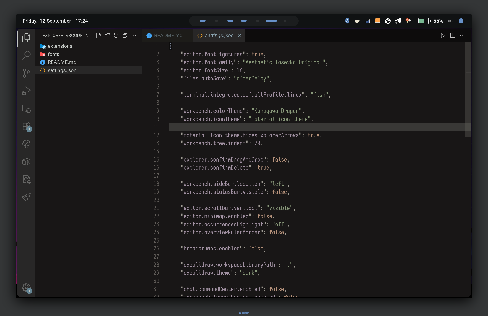
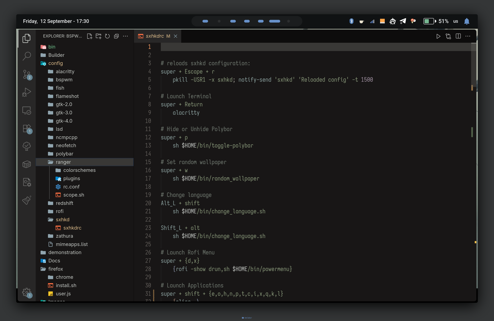

## Custom VS Code settings
### Installation

After cloning and installing VS Code:
```bash
$ cp settings.json $HOME/.config/Code/User/
$ cp -r extensions/ $HOME/.vscode/
$ cp -r fonts/* $HOME/.fonts/
$ fc-cache -fv
```

### Visualization


